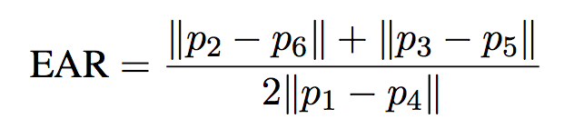

# [_No Sleepy Time_](https://github.com/SammriddhGupta/NoSleepyTime/edit/main/README.md)

## A Drowsiness Detection System
### Alerts you by tracking your eye and mouth movement


## Motivation

- Many people face long nights at work. Especially truck drivers, security guards and healthcare professionals. These are jobs that are fundamental to society and to the health, wellbeing and comfort of the general population. 

- Getting behind the wheel while feeling tired is not uncommon. It’s something most drivers have probably done. It can be incredibly dangerous, unless we find a way to warn drivers when their tiredness has become too severe and is impairing their driving.

Therefore I decided to work on a detection system using facial recognition to detect drowsiness and trigger an alert before it is too late


## Technology Stack

- **OpenCV**

OpenCV (Open Source Computer Vision Library) is an open source computer vision and machine learning software library. 

- **Dlib** 

Dlib is an open source suite of applications and libraries written in C++ under a permissive Boost license. Dlib offers a wide range of functionality across a number of machine learning sectors, including classification and regression, numerical algorithms such as quadratic program solvers, an array of image processing tools, and diverse networking functionality, among many other facets.

- **Face_Recognition**

A python package that wraps Dlib’s face recognition functions into a simple, easy to use API.


## Features

1. The detector displays the following when the status is detected as: 
- **active** - eyes open - no alert rings
- **drowsy** - eyes slightly closed - alert rings
- **sleeping** - eyes fully closed - alert rings
- **yawning** - mouth wide open - alert rings

2. The alert audio does not stop playing until you stop yawning and your eyes are fully open

3. You can press 'q' to escape the application and stop the detection

4. The date and timestamp is displayed at the bottom left of the screen

5. The frame rate is displayed in fps at the bottom right of the screen


## Working 

Facial landmarks is a technique for localizing and representing salient regions or facial parts of the person’s face. It has various applications like face alignment, head pose estimation, face swapping, blink detection, drowsiness detection and so on. 
In our use case, the aim is to detect facial structures on the person’s face using a method called shape prediction.

There are 2 important steps in facial landmark detection: 
- Detecting or Localizing the face.
- Predicting the landmarks of key facial regions in the detected face.

The pre-trained facial landmark detector inside the dlib library is an implementation of the paper 

[One Millisecond Face Alignment with an Ensemble of Regression Trees (by Kazemi and Sullivan (2014)](https://www.cv-foundation.org/openaccess/content_cvpr_2014/papers/Kazemi_One_Millisecond_Face_2014_CVPR_paper.pdf) 

The facial landmark detector which is pre-trained inside the Dlib library of python for detecting landmarks, is used to estimate the location of 68 points or (x, y) coordinates which map to the facial structures. 
These 68-(x,y) coordinates represent the important regions of the face like mouth, left eyebrow, right eyebrow, left eye, right eye, nose, and jaw.

The indices of the 68 coordinates or points can be easily visualized in the image below:


The Locations of the Facial Features are as follows:
- The left eye is accessed with points [42, 47].
- The right eye is accessed using points [36, 41].
- The mouth is accessed through points [48, 67].

Once the landmarks are predicted, we use only the eye landmarks and the mouth landmarks to determine the Eye Aspect Ratio(EAR) and Mouth Aspect Ratio(MAR) to check if a person is drowsy.

Based on the paper, [Real-Time Eye Blink Detection using Facial Landmarks](http://vision.fe.uni-lj.si/cvww2016/proceedings/papers/05.pdf)

We can derive an equation that reflects this relation called the eye aspect ratio (EAR):


The idea is to design a system which rings a constant alarm whenever the status is detected as drowsy or sleepy based on the EAR ratio. 
An additional feature is the detection of yawning as well. 

### A little bit on the Dlib library: 

The dlib library provides two functions that can be used for face detection:
- A HOG + Linear SVM face detector that is accurate and computationally efficient.
- A Max-Margin (MMOD) CNN face detector that is both highly accurate and very robust, capable of detecting faces from varying viewing angles, lighting conditions, and occlusion.

The _get_frontal_face_detector_ function does not accept any parameters. 
A call to it returns the pre-trained HOG + Linear SVM face detector included in the dlib library.
Dlib’s HOG + Linear SVM face detector is fast and efficient. By nature of how the Histogram of Oriented Gradients (HOG) descriptor works, it is not invariant to changes in rotation and viewing angle.


## Basic Flow

- We’re going to use OpenCV for the basic computer vision functions and integrations
- The Dlib library for the inbuilt facial recognition landmark detection model
- The imutils package to use some functions that will help us convert the landmarks to NumPy array and make it easy for us to use. 
- The pygame package to play the audio alert 
- We set the conditions to calculate the eye and mouth aspect ratio, displaying the status messages and playing the alert sound when needed


## Setup and Run

- **Step 1**
Clone the repository in your system by:

``` git clone https://github.com/SammriddhGupta/NoSleepyTime.git ```

   Or directly download the zip

- **Step 2**
Download the file

<b>shape_predictor_68_face_landmarks.dat</b>

- **Step 3**
Install all the system requirements by:

```  pip install -r requirements.txt ```

- **Step 4**
After everything has been setup, run the command: 

``` python Detection.py```


## References 
- [Real-Time Eye Blink Detection using Facial Landmarks](http://vision.fe.uni-lj.si/cvww2016/proceedings/papers/05.pdf)
- [One Millisecond Face Alignment with an Ensemble of Regression Trees](https://www.cv-foundation.org/openaccess/content_cvpr_2014/papers/Kazemi_One_Millisecond_Face_2014_CVPR_paper.pdf)
- [Face detection with dlib (HOG and CNN)](https://pyimagesearch.com/2021/04/19/face-detection-with-dlib-hog-and-cnn/)
- [Drowsiness detection with OpenCV](https://pyimagesearch.com/2017/05/08/drowsiness-detection-opencv/)
- [Yawn Detection using OpenCV and Dlib](https://www.geeksforgeeks.org/yawn-detection-using-opencv-and-dlib/?ref=rp)
- [Driver-Drowsiness-Detection](https://github.com/infoaryan/Driver-Drowsiness-Detection)
